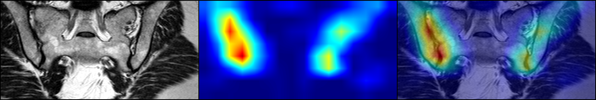

# CEAS - Classification of Early Ankylosing Spondylitis based on CNNs and clinical feature
Pytorch implement of classification for early ankylosing spondylitis. Paper can be found [here](about;blank).

### TL;DR

Training CNNs

    python training_script.py --gpus 0 --use_CF --seq FS

Test CNNs
    
    python loss_log_decode.py 
    python test.py
    python ci.py

Visualization

    python GradCAM_demo.py
    
### Requirements

 To train and test, you need:
 1. Custom data set that contains at least one kind of sequence of SJI-MRIs with ROIs. 
If you have all three sequences (T1WI, T2WI and FS), our model should work without any modifications.
 2. At least one nVidia GPU.
 3. Python 3.6.5 (not sure whether other versions will work).
 4. Install the necessary packages listed in `requirements.txt`.
 5. A file that contain patients' clinical information.(unnecessary)
#### Install the requirements

    pip install -r requirements.txt

### Data set structure
#### Image data
Make sure your data set to be organized like following structure to avoid `FileNotFoundError` during training and testing.

    ├── npy_exp1
    │   ├── train
    │   │   ├── AS
    │   │   │   ├── patient0001
    │   │   │   │  ├── FS.nii.gz
    │   │   │   │  ├── FS_mask.nii.gz
    │   │   │   │  ├── T1.nii.gz
    │   │   │   │  └── T1_mask.nii.gz
    │   │   │   │  ├── T2.nii.gz
    │   │   │   │  └── T2_mask.nii.gz
    │   │   │   ├── patient0002
    │   │   │   ├── patient0003
    │   │   │   ...
    │   │   └── nonAS
    │   └── test
    │       ├── AS
    │       └── nonAS

##### Clinical information

Clinical information could be save as `.xlsx`(recommand) file 
under the root directory of this project with the following indices.

|Patient_ID|Age(year old)|Gender(M:1,F:0)|Disease Duration(months)|ESR|CRP|HLA-B27(pos:1,neg:0)|Label(AS:1,non-AS:0)|
|:---:|:---:|:---:|:---:|:---:|:---:|---:|---:|
|patient0001|18|1|12|65|39|1|1|
|patient0002|24|0|6|0|11|0|0|
|patient0003|...|...|...|...|...|...|...|

If the indices you use are not exactly same as the above, some modifications are need in some `.py` that use the clinical information. 

### Preprocessing

Supposing that all the image data in your custom data set has been converted to `.nii` format
and has N4 bias field corrected.

Before training, there are several preprocesses to be done:
1. Resampling and save the largest ROI in the mask by

    `python resize_save_largest_ROI.py`.
   
   The target spacing is determined by the most frequent spacing in your custom data set.

3. To speed up the loading procedure of initialization of `AS_Dataset`, converting `.nii` to `.npy`.

    `python nii2npy.py`

4. To speed up the `dataloader` and reduce the size of dataset, we crop the original volume to 
generate the smallest patch that contain the whole ROI:

    `python dataset_reduction.py`

5. Clinical data imputation:

    `python data_imputation`

6. Perform the LASSO regression to select the relevant clinical feature:

    `python lasso.py`

### Training

You should specify 4 parameters like the following example:

    python train.py  --k 1 --gpus 0 --use_CF --seq FS

Or you  can directly run the `training_script.py` 
to perform the whole five-fold cross-validation in one command:

    python training_script.py --gpus 0 --use_CF --seq FS

Except for `k`, which represents the `k`th fold of five-fold cross-validation, you still need to specify the other 3 parameters as well.
### Test

You need to run `loss_log_decode.py` before `test.py` to get the optimal models 
from all the training iteration by calculating the largest AUROC.

    python loss_log_decode.py
    python test.py

Commands listed above don't give a stats of the model assessment, but rather the predictions in patient level 

To get the final results like the paper shows, you'll also need to calculate the confidential intervals via bootstrap:

    python ci.py

Note that, the variable `models` in `ci.py` should be modified depending on combination of models you want to compare.

### Visualization

    python GradCAM_demo.py

Again, you should modify the variable `patient_paths` in `GradCAM_demo.py` to specify the patients exactly to be visualized. 

Example result:

